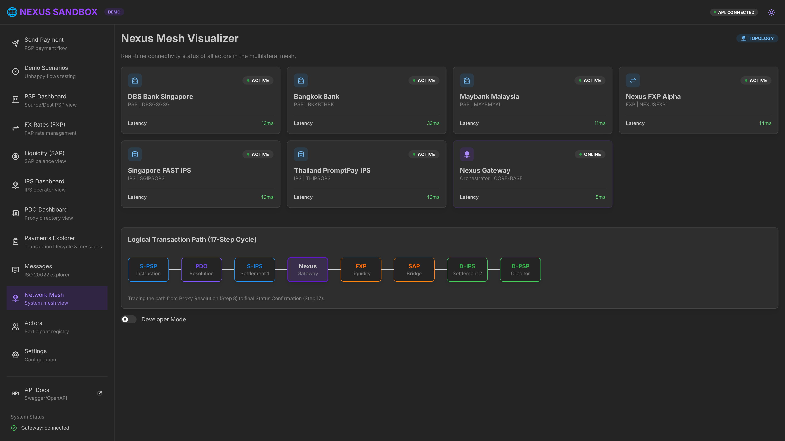

# Nexus Sandbox 🌐

> **A complete educational sandbox implementation of the Nexus Global Payments scheme**

[](http://localhost:8080)
[](https://siva-sub.github.io/nexus-sandbox/)
[](http://localhost:8000/docs)
[](LICENSE)

Created by **[Siva Subramanian](https://sivasub.com)** | [GitHub](https://github.com/siva-sub) | [LinkedIn](https://www.linkedin.com/in/sivasub987/)

---

## 🎯 What is This?

This is a **portfolio project** demonstrating expertise in:
- **Cross-border instant payments** architecture
- **ISO 20022** message handling (pacs.008, pacs.002, camt.056)
- **Microservices** orchestration with Docker
- **Event-driven architecture** with Kafka
- **Distributed tracing** with Jaeger/OpenTelemetry

Based on the official [Nexus Global Payments documentation](https://docs.nexusglobalpayments.org/).

> ⚠️ **Disclaimer**: This is an educational sandbox. Not affiliated with Nexus Global Payments Ltd. or any founding central banks.

---

## 🚀 Quick Start (3 Steps)

### Prerequisites
- [Docker Desktop](https://www.docker.com/products/docker-desktop/) installed and running

### Step 1: Clone the Repository
```bash
git clone https://github.com/siva-sub/nexus-sandbox.git
cd nexus-sandbox
```

### Step 2: Start the Sandbox
```bash
# Recommended: Lite profile - starts in ~20 seconds
docker compose -f docker-compose.lite.yml up -d

# Alternative: Full stack with Kafka & all simulators (~2 min)
# docker compose up -d
```

### Step 3: Open the Demo
```
🌐 http://localhost:8080
```

**That's it!** Click **"Send Payment"** in the sidebar to start your first cross-border payment.



### 🎬 Quick Flow Demo

Watch the **Quick Flow** in action - a full end-to-end payment simulation in under 30 seconds.

https://github.com/siva-sub/nexus-sandbox/raw/main/docs/assets/demo-quick-flow.mp4

<video src="https://github.com/siva-sub/nexus-sandbox/raw/main/docs/assets/demo-quick-flow.mp4" controls width="100%" title="Nexus Sandbox Quick Flow Demo"></video>

### 📖 Documentation Links
- [**Usage Guide**](./docs/USAGE_GUIDE.md): Start here to simulate your first payment.
- [**Integration Guide**](./docs/INTEGRATION_GUIDE.md): Connect your own PSP/FXP/IPS to the sandbox.
- [**API Reference**](./docs/api/API_REFERENCE.md): Complete list of available endpoints.
- [**Message Examples**](./docs/MESSAGE_EXAMPLES.md): Full ISO 20022 XML samples for all 11 types.
- [**Walkthrough**](./docs/E2E_DEMO_SCRIPT.md): Detailed end-to-end demo implementation walkthrough.

---

## 🖥️ Access Points

| Service | URL | Description |
|---------|-----|-------------|
| **Local Dashboard** | http://localhost:8080 | Interactive UI (local Docker) |
| **Live Demo** | [nexus-sandbox/pages](https://siva-sub.github.io/nexus-sandbox/) | Static preview (GitHub Pages) |
| **API Docs (ReDoc)** | http://localhost:8080/api/redoc | Beautiful API documentation |
| **API Docs (Swagger)** | http://localhost:8080/api/docs | Interactive API explorer |
---

## 🌐 GitHub Pages Demo vs Docker

The sandbox offers two ways to experience the Nexus payment flow:

| Feature | GitHub Pages Demo | Docker (Full) |
|---------|-------------------|---------------|
| **Data Persistence** | Session memory only | PostgreSQL database |
| **Payment Tracking** | Mock state store | Real event sourcing |
| **ISO 20022 Messages** | Generated templates | XSD-validated XML |
| **API Calls** | Simulated responses | Live FastAPI backend |
| **Multi-user** | Single session | Concurrent sessions |
| **Unhappy Flows** | Simulated rejection codes | Backend scenario triggers |

> 💡 **Use GitHub Pages for**: Quick evaluation, UI exploration, understanding the flow  
> 🔧 **Use Docker for**: Integration testing, API development, realistic sandbox

The GitHub Pages demo provides a **fully functional UI demonstration** with mock data that accurately reflects the payment flow, fee structure, and lifecycle visualization. Payments submitted in the demo are stored in session memory and can be viewed in the Payment Explorer.

For **production-grade testing** and API integration, use the Docker setup which provides real database persistence, XSD validation, and event-driven architecture.

---

## 🔌 API Routes Overview

The sandbox exposes **60+ endpoints**. Here's the complete reference:

### Core Payment Flow
| Method | Endpoint | Description |
|--------|----------|-------------|
| `POST` | `/v1/iso20022/pacs008` | Submit pacs.008 payment instruction |
| `POST` | `/v1/iso20022/pacs002` | Receive pacs.002 status report |
| `GET` | `/v1/payments` | List all payments |
| `GET` | `/v1/payments/{uetr}/events` | Get payment lifecycle events |
| `GET` | `/v1/payments/{uetr}/messages` | Get ISO 20022 XML messages |
| `GET` | `/v1/payments/{uetr}/status` | Get current payment status |

### Quotes & FX Rates
| Method | Endpoint | Description |
|--------|----------|-------------|
| `GET` | `/v1/quotes` | Retrieve FX quotes for corridor |
| `GET` | `/v1/quotes/{quote_id}` | Get quote details |
| `POST` | `/v1/rates` | Submit FX rate (FXP) |
| `GET` | `/v1/rates` | List FXP rates |
| `DELETE` | `/v1/rates/{rate_id}` | Withdraw FX rate |

### Addressing & Proxy Resolution
| Method | Endpoint | Description |
|--------|----------|-------------|
| `POST` | `/v1/addressing/resolve` | Resolve proxy → account (acmt.023/024) |
| `POST` | `/v1/iso20022/acmt023` | Submit acmt.023 resolution request |
| `POST` | `/v1/iso20022/acmt024` | Submit acmt.024 resolution report |
| `GET` | `/v1/address-types/{id}/inputs` | Get input fields for address type |

### Actor Registry (Plug-In Your Own)
| Method | Endpoint | Description |
|--------|----------|-------------|
| `POST` | `/v1/actors/register` | **Register your actor** |
| `GET` | `/v1/actors` | List all registered actors |
| `GET` | `/v1/actors/{bic}` | Get actor by BIC |
| `PATCH` | `/v1/actors/{bic}/callback` | Update callback URL |
| `DELETE` | `/v1/actors/{bic}` | Deregister actor |

### PSP/IPS/PDO Dashboards
| Method | Endpoint | Description |
|--------|----------|-------------|
| `GET` | `/v1/psps` | List PSPs |
| `GET` | `/v1/psps/{bic}/payment-summary` | PSP payment statistics |
| `GET` | `/v1/ips` | List IPS operators |
| `GET` | `/v1/ips/{id}/members` | IPS member institutions |
| `GET` | `/v1/pdos` | List PDOs |
| `GET` | `/v1/pdos/country/{code}/registrations` | PDO proxy registrations |

### Liquidity & Settlement (SAP)
| Method | Endpoint | Description |
|--------|----------|-------------|
| `POST` | `/v1/iso20022/camt103` | Submit camt.103 liquidity reservation |
| `GET` | `/v1/liquidity/balances` | FXP balances at SAPs |
| `POST` | `/v1/liquidity/reserve` | Reserve liquidity |
| `GET` | `/v1/liquidity/settlement-calc` | Calculate settlement amounts |

### Returns & Recalls
| Method | Endpoint | Description |
|--------|----------|-------------|
| `POST` | `/v1/iso20022/pacs004` | Payment return (pacs.004) |
| `POST` | `/v1/iso20022/camt056` | Cancellation request (recall) |
| `POST` | `/v1/iso20022/camt029` | Resolution of investigation |
| `GET` | `/v1/iso20022/recalls` | List recall requests |

### Reference Data
| Method | Endpoint | Description |
|--------|----------|-------------|
| `GET` | `/v1/countries` | List supported countries |
| `GET` | `/v1/currencies` | List supported currencies |
| `GET` | `/v1/fin-insts/{role}` | Financial institutions by role |
| `GET` | `/v1/fees-and-amounts` | Calculate fees breakdown |
| `GET` | `/v1/pre-transaction-disclosure` | Full PTD (critical for compliance) |

### QR Codes
| Method | Endpoint | Description |
|--------|----------|-------------|
| `POST` | `/v1/qr/parse` | Parse EMVCo QR |
| `POST` | `/v1/qr/generate` | Generate EMVCo QR |
| `POST` | `/v1/qr/upi/parse` | Parse UPI QR |

> 📖 **Interactive Docs**: [ReDoc](http://localhost:8080/api/redoc) | [Swagger](http://localhost:8080/api/docs)

---

## 🧩 Plug In Your Own Actors

Want to test your PSP, FXP, or IPS implementation? The sandbox supports self-registration:

### Register Your Actor
```bash
curl -X POST http://localhost:8000/v1/actors/register \
  -H "Content-Type: application/json" \
  -d '{
    "bic": "YOURPSPXXX",
    "actorType": "PSP",
    "name": "Your Organization",
    "countryCode": "SG",
    "callbackUrl": "https://your-server.com/nexus/callback"
  }'
```

### Test Your Integration
1. **Submit a payment** → `POST /pacs008` with your BIC
2. **Receive callbacks** → Sandbox sends `pacs.002` to your `callbackUrl`
3. **Inspect messages** → View XML in the [ISO Explorer](http://localhost:8080/explorer)

### Pre-Seeded Actors
| BIC | Name | Type | Country |
|-----|------|------|---------|
| `DBSGSGSG` | DBS Bank Singapore | PSP | SG |
| `BKKBTHBK` | Bangkok Bank | PSP | TH |
| `MAYBMYKL` | Maybank Malaysia | PSP | MY |
| `NEXUSFXP1` | Nexus FXP Alpha | FXP | SG |

> 📖 **Detailed Guide**: See [Integration Guide](./docs/INTEGRATION_GUIDE.md) for full actor registration, callback testing, and unhappy flow triggers.

---

## 🏗️ Architecture

```
┌─────────────────────────────────────────────────────────────────────────────┐
│                           NEXUS SANDBOX                                      │
├─────────────────────────────────────────────────────────────────────────────┤
│                                                                              │
│  ┌─────────────┐     ┌─────────────┐     ┌─────────────┐                    │
│  │ Demo        │     │ Swagger UI  │     │ Jaeger      │                    │
│  │ Dashboard   │     │             │     │ Tracing     │                    │
│  │ :8080       │     │ :8081       │     │ :16686      │                    │
│  └──────┬──────┘     └──────┬──────┘     └──────┬──────┘                    │
│         │                   │                   │                            │
│         └───────────────────┼───────────────────┘                            │
│                             │                                                │
│                    ┌────────▼────────┐                                       │
│                    │  Nexus Gateway  │                                       │
│                    │     :8000       │                                       │
│                    │  (FastAPI)      │                                       │
│                    └────────┬────────┘                                       │
│                             │                                                │
│         ┌───────────────────┼───────────────────┐                            │
│         │                   │                   │                            │
│  ┌──────▼──────┐     ┌──────▼──────┐     ┌──────▼──────┐                    │
│  │ Postgres    │     │ Redis       │     │ Kafka       │                    │
│  │ :5432       │     │ :6379       │     │ :9092       │                    │
│  └─────────────┘     └─────────────┘     └─────────────┘                    │
│                                                                              │
├─────────────────────────────────────────────────────────────────────────────┤
│                        SIMULATORS                                            │
├─────────────────────────────────────────────────────────────────────────────┤
│                                                                              │
│  ┌─────────────┐  ┌─────────────┐  ┌─────────────┐                          │
│  │ PSP-SG      │  │ PSP-TH      │  │ PSP-MY      │  Payment Service         │
│  │ DBS Bank    │  │ Kasikorn    │  │ Maybank     │  Providers               │
│  │ :3001       │  │ :3002       │  │ :3003       │                          │
│  └─────────────┘  └─────────────┘  └─────────────┘                          │
│                                                                              │
│  ┌─────────────┐  ┌─────────────┐  ┌─────────────┐                          │
│  │ IPS-SG      │  │ IPS-TH      │  │ FXP-ABC     │  Instant Payment         │
│  │ FAST        │  │ PromptPay   │  │ FX Provider │  Systems + FX            │
│  │ :3101       │  │ :3102       │  │ :3201       │                          │
│  └─────────────┘  └─────────────┘  └─────────────┘                          │
│                                                                              │
│  ┌─────────────┐  ┌─────────────┐                                           │
│  │ SAP-DBS     │  │ PDO-SG      │  Settlement +                             │
│  │ Settlement  │  │ PayNow Dir  │  Proxy Directory                          │
│  │ :3301       │  │ :3401       │                                           │
│  └─────────────┘  └─────────────┘                                           │
│                                                                              │
└─────────────────────────────────────────────────────────────────────────────┘
```

---

## 📊 Demo Dashboard Screens

### 1. Interactive Demo (⭐ Featured)
**Fully End-to-End Functional** - `http://localhost:8080/demo`
- ✅ **Real ISO 20022 XML Submission**: Constructs valid pacs.008.001.08 XML and submits to backend API
- ✅ **Database Persistence**: All payments (ACCC + RJCT) stored in PostgreSQL
- ✅ **Payment Explorer Integration**: Full UETR with "View in Explorer" link
- ✅ **4-Step Guided Journey**:
  1. **Payment Details**: Source/destination countries, amount type, recipient proxy
  2. **Select Quote**: Display quotes from FXPs with exchange rates and expiry countdown
  3. **Confirm Payment**: Pre-Transaction Disclosure (PTD) breakdown with fee transparency
  4. **Lifecycle Trace**: Visual timeline showing payment journey (happy or rejection)
- ✅ **9 Unhappy Flow Scenarios**: AB04, TM01, DUPL, AM04, AM02, BE23, AC04, RR04
- ✅ **Demo Data Management**: Purge test payments via Settings page

### 2. Payment Explorer
**Transaction History & Message Viewer** - `http://localhost:8080/explorer`
- Search by UETR to view complete payment details
- 17-step lifecycle visualization
- ISO 20022 message inspection (pacs.008, pacs.002 XML)
- Status tracking with reason codes (ACCC, RJCT, AB04, TM01, etc.)
- Debug panel with event timeline

### 3. Landing Page
- Overview of Nexus architecture
- Key statistics and capabilities
- Quick navigation to all features

### 4. Actors & Fees
- All 13 participant types explained
- Fee structure visualization
- **ISO 20022 Protocol Parity**: High-fidelity support for 11 distinct message types across the payment lifecycle.
- **Message Observatory**: Every XML payload (pacs.008, pacs.002, acmt.023/024, etc.) is persisted and available for forensic audit.
- **Compliance Validation**: Real-time XSD schema validation for all inbound and outbound messages.

---

## 🏗 Supported ISO 20022 Messages

The Nexus Sandbox implements **full protocol parity** for the following message sets. Refer to the [**Message Examples Guide**](./docs/MESSAGE_EXAMPLES.md) for full XML payloads.

### 🔹 Release 1 (Core Flow)
- `pacs.008` - FI to FI Customer Credit Transfer (Payment Instruction)
- `pacs.002` - Payment Status Report (Acceptance/Rejection)
- `acmt.023` - Identification Verification Request (Proxy Resolution)
- `acmt.024` - Identification Verification Report
- `camt.054` - Bank to Customer Debit Credit Notification (Reconciliation)

### 🔸 Optional (SAP Integration)
- `camt.103` - Create Reservation (Liquidity Reservation at SAP)
- `pain.001` - Customer Credit Transfer Initiation (Corporate Channel Initiation)

### 🚀 Future Roadmap (Forensic Persistence)
- `pacs.004` - Payment Return
- `pacs.028` - FI to FI Payment Status Request
- `camt.056` - FI to FI Payment Cancellation Request (Recall)
- `camt.029` - Resolution of Investigation (Recall Response)
- **Complete ISO 20022 Coverage**: 
  - 100 XSD schemas in `specs/iso20022/`
  - Includes: pain.*, camt.*, acmt.*, pacs.*

---

## 🔌 API Endpoints

### Reference Data
```bash
# Get supported currencies
GET /currencies

# Get financial institutions
GET /financial-institutions?country=SG

# Get address types
GET /address-types-inputs?destinationCountry=TH
```

### Quotes & FX
```bash
# Get quote
GET /quotes?sourcePspBic=DBSSSGSG&destinationPspBic=KASITHBK&sourceCurrency=SGD&destinationCurrency=THB&sourceAmount=1000

# Lock quote
POST /quotes/{quoteId}/lock
```

### Payments
```bash
# Submit payment
POST /pacs008?pacs002Endpoint=https://callback.example.com

# Get payment status
GET /payments/{uetr}
```

### Returns & Recalls
```bash
# Return payment
POST /pacs004

# Recall payment
POST /camt056
```

---

## 🧪 Running Tests

```bash
# Run all tests
cd services/nexus-gateway
pytest

# Run with coverage
pytest --cov=src --cov-report=html

# Run specific test
pytest tests/test_quotes.py -v
```

---

## 📁 Project Structure

```
nexus-sandbox/
├── docker-compose.yml          # Service orchestration
├── start.sh                    # One-command launcher
├── services/
│   ├── demo-dashboard/         # Frontend UI
│   │   ├── Dockerfile
│   │   ├── nginx.conf
│   │   ├── index.html
│   │   ├── api.js             # API integration
│   │   └── screens/           # Dashboard pages
│   ├── nexus-gateway/          # Core API (FastAPI)
│   ├── psp-simulator/          # PSP mockups
│   ├── ips-simulator/          # IPS mockups
│   ├── fxp-simulator/          # FX provider
│   ├── sap-simulator/          # Settlement provider
│   └── pdo-simulator/          # Proxy directory
├── migrations/                 # Database schema
├── specs/                      # ISO 20022 XSDs
└── docs/                       # Documentation
```

---

## 🛠️ Technology Stack

| Component | Technology |
|-----------|------------|
| **API** | Python 3.11, FastAPI, Pydantic |
| **Database** | PostgreSQL 16 |
| **Cache** | Redis 7 |
| **Messaging** | Apache Kafka |
| **Tracing** | Jaeger, OpenTelemetry |
| **Frontend** | React 19, TypeScript, Mantine UI v7, Vite |
| **ISO 20022** | 100 XSD schemas (pacs.*, acmt.*, camt.*, pain.*) |
| **Container** | Docker, Docker Compose |

---

## 📖 References

- [NGP Official Documentation](https://docs.nexusglobalpayments.org/)
- [ISO 20022 Message Catalogue](https://www.iso20022.org/catalogue-messages)
- [BIS Innovation Hub - Nexus](https://www.bis.org/about/bisih/topics/suptech_regtech/nexus.htm)

---

## 📄 License

MIT License © 2026 [Siva Subramanian](https://sivasub.com)

---

## 🤝 Contact

**Siva Subramanian**
- 🌐 Website: [sivasub.com](https://sivasub.com)
- 💼 LinkedIn: [linkedin.com/in/sivasub987](https://www.linkedin.com/in/sivasub987/)
- 🐙 GitHub: [github.com/siva-sub](https://github.com/siva-sub)
- 📧 Email: [hello@sivasub.com](mailto:hello@sivasub.com)
